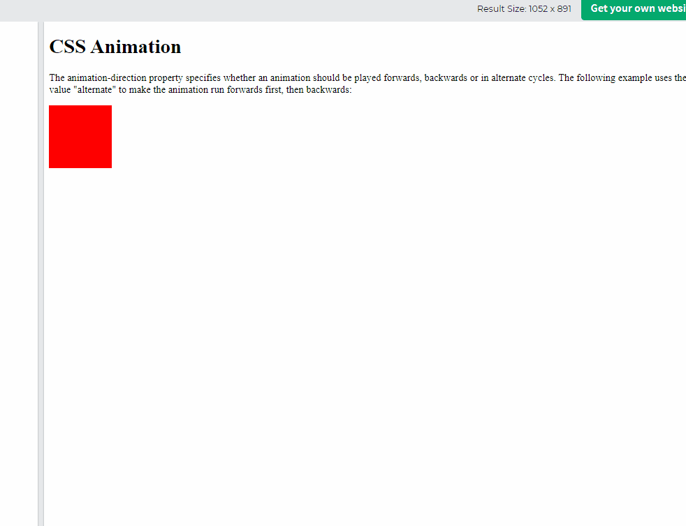
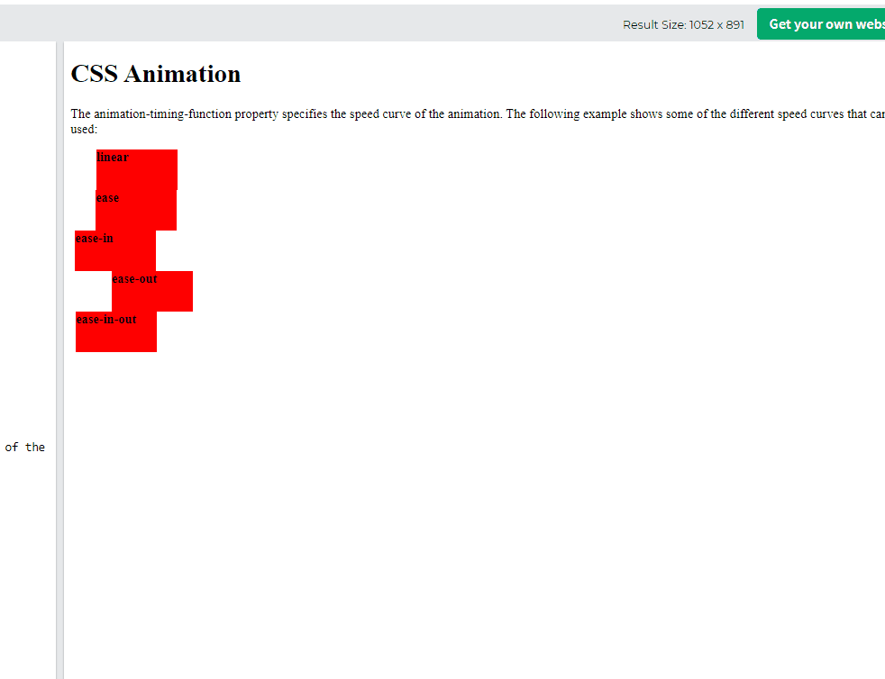

## CSS Animations
* Allow animation of HTML elements without JS or Flash!
* we can change  as many CSS properties we want, as many times as we want.
* To use CSS animation, we must first specify some keyframes for the animation.

## @keyframe Rule
* When we specify CSS style inside the **@keyframes** rule
 the animation will gradually change from the current style to the new style at certain times.
 * To get an animation to work, we must bind the animation to an element.

 ```css
 /* The animation code */
@keyframes example {
  from {background-color: red;}
  to {background-color: yellow;}
}

/* The element to apply the animation to */
div {
  width: 100px;
  height: 100px;
  background-color: red;
  animation-name: example;
  animation-duration: 4s;
}
 ```

 ``
 Note: The animation-duration property defines how long an animation should take to complete. we must define animation-duration otherwise it does not work, because default duration is 0
 ``

 * Above example style is changing "from" and "to" (which represents 0%(start) and 100%(complete))
 * It is possible to use percentage

 ```css
/* The animation code */
@keyframes example {
  0%   {background-color:red; left:0px; top:0px;}
  25%  {background-color:yellow; left:200px; top:0px;}
  50%  {background-color:blue; left:200px; top:200px;}
  75%  {background-color:green; left:0px; top:200px;}
  100% {background-color:red; left:0px; top:0px;}
}

/* The element to apply the animation to */
div {
  width: 100px;
  height: 100px;
  position: relative;
  background-color: red;
  animation-name: example;
  animation-duration: 4s;
}
 ```
## Delay an Animation
* The **animation-delay** property specifies a delay for the start of an animation.

```css
div {
  width: 100px;
  height: 100px;
  position: relative;
  background-color: red;
  animation-name: example;
  animation-duration: 4s;
  animation-delay: 2s;
}
```
* Negative value is also valid, it had been already playing
```css
div {
  width: 100px;
  height: 100px;
  position: relative;
  background-color: red;
  animation-name: example;
  animation-duration: 4s;
  animation-delay: -2s;
}
```
## Set How Many Times an Animation Should Run
* The **animation-iteration-count** property specifies the number of times an animation should run.

```css
div {
  width: 100px;
  height: 100px;
  position: relative;
  background-color: red;
  animation-name: example;
  animation-duration: 4s;
  /* animation will run 3 times */
  animation-iteration-count: 3;
  /* we can set it with infinite to run it forever */
 animation-iteration-count: infinite;
}
```

## Run Animation in Reverse Direction or Alternate Cycles
* The **animation-direction** property specifies that an animation should be played forwards, backwards or in alternate cycles.

* **normal:** Animation is played normal flow
* **reverse:** Animation is played reverse direction
* **alternate:** Animation is played forwards first, then backwards
* **alternate-reverse** Animation is played backwards first, then forwards
```css
div {
  width: 100px;
  height: 100px;
  position: relative;
  background-color: red;
  animation-name: example;
  animation-duration: 4s;
  animation-direction: reverse;
}
```
```css
div {
  width: 100px;
  height: 100px;
  position: relative;
  background-color: red;
  animation-name: example;
  animation-duration: 4s;
  animation-iteration-count: 2;
  animation-direction: alternate;
}
```


## Specify the Speed curve of the Animation
* The **animation-timing-function** property specifies the speed curve of the animation.
* its property exactly same with transition speed function
  * **ease**: animation with a slow start, then fast, then slow end.
  * **linear**: animation with same speed
  * **ease-in**:animation with slow start, then fast
  * **ease-out**: animation with fast start, then slow end
  * **ease-in-out:** animation with slow start, then fast, slow end
  * **cubic-bezier:** let us provide custom animation speed (cubic-bezier(n, n, n, n))

  

  ## Shorthand Property
  * we can write all properties in one line

  * instead of this;

```css
  div {
  animation-name: example;
  animation-duration: 5s;
  animation-timing-function: linear;
  animation-delay: 2s;
  animation-iteration-count: infinite;
  animation-direction: alternate;
} 
```


* we can write one-line by using **animation**
```css
div {
  animation: example 5s linear 2s infinite alternate;
}
 ```
## ===========> Summary
* we must define animation duration
* we should define **@keyframe**, then animation will play gradually
* we can define **from** and **to**, we can count it **0%** and **100%** .
* we can use **animation-iteration-count** that define how many count animation play. we can set it with **infinite**
* we can use **animation-direction** to set animation direction
  * normal
  * reverse
  * alternate: forward then backward
  * reverse-alternate: backward then forward
* Animation speed
* we can define all animation in one-line