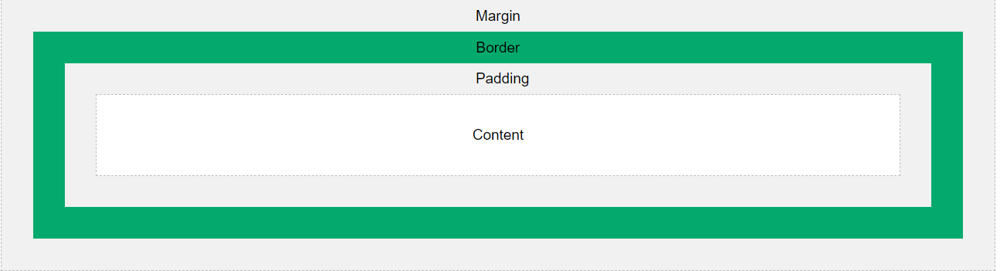

## CSS Box Model
* All HTML Elements can be considered as boxes.
* A Element consists of: margins, borders, padding and the actual content.



* **Content**: The content of the box that text and images appear
* **Padding**: Clears an area around the content. Padding is transparent
* **Border**: A border that goes around the padding and content
* **Margin**: Clears an area outside the border. Margin is transparent

```css
div {
  width: 320px;
  padding: 10px;
  border: 5px solid gray;
  margin: 0;
}
/*
320px (width)
+ 20px (left + right padding)
+ 10px (left + right border)
+ 0px (left + right margin)
= 350px
*/
```

### Box-sizing
* Box-sizing allow us to include the padding and border in an element's total width and height

**Content Box**: Default . The width and height properties (and min/max properties) includes only the content. Border and padding are not included.
**Border Box:** The width and height properties (and min/max properties) includes content, padding and border

```css
box-sizing : border-box; /* border and padding included original width and height */
box-sizing: content-box; /* Default, padding and border are not included original width and height  */
```

## ======> Summary
* All HTML elements are created by content, padding, border and margin
* Box-sizing: Defines if Border and padding include original width and height or not.
  * Content-box: Default . Border and padding are not included original width and height.
  * Border-box: Border and padding are included original width and height.

