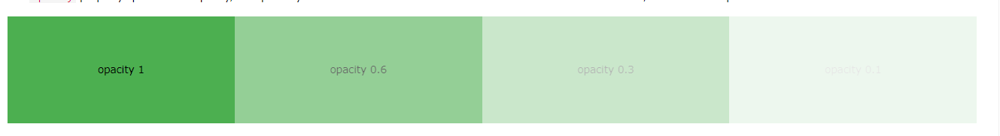
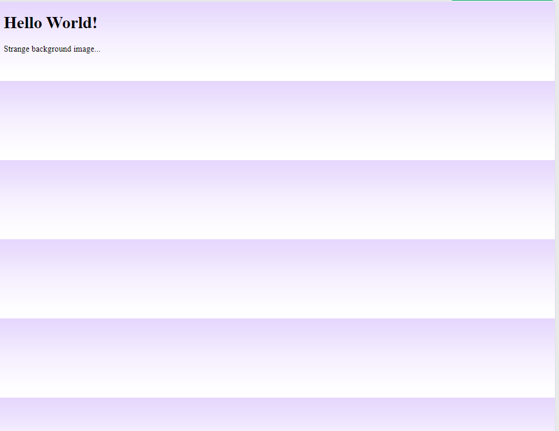
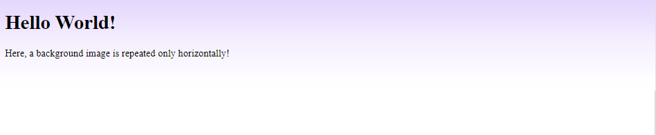
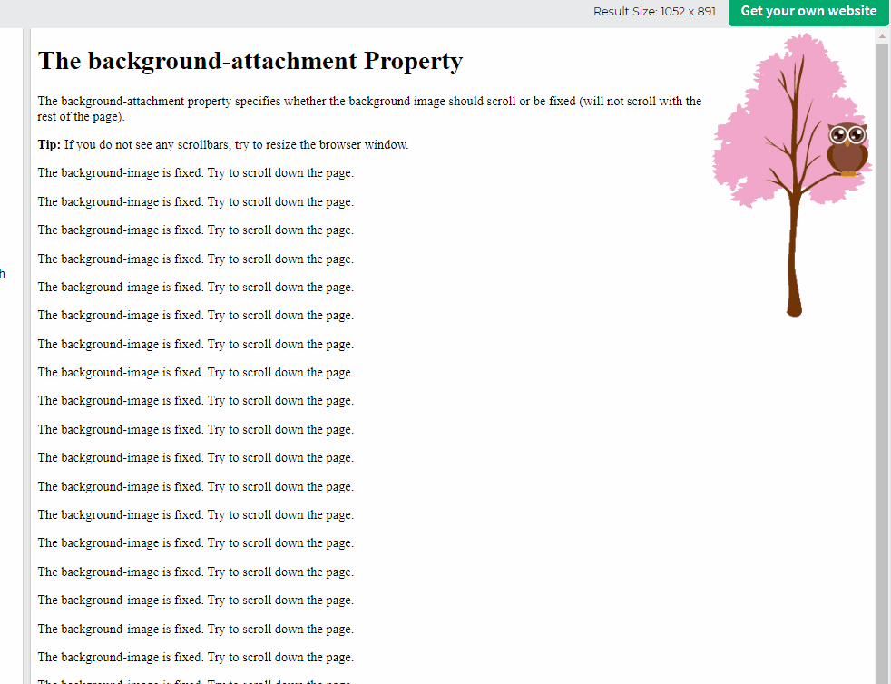
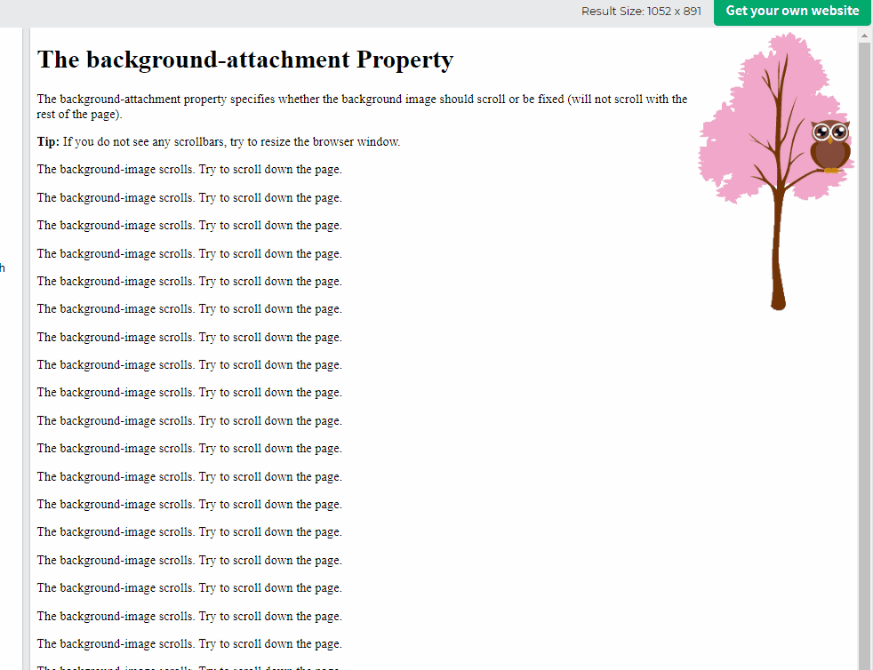

## CSS Background
* There are several properties of Background attribute
    * **background-color**
    * **background-image**
    * **background-repeat**
    * **background-attachment**
    * **background-position**
    * **background (shorthand)**

### CSS background-color
* The **background-color** property specifies the background color of an element

```css
background-color: lightblue;
```
a color is most often specified by:
* a **valid color name** - like "red"
* a **HEX** value - like "#ff0000"
* an **RGB** value - like "rgb(255, 0, 0)"

### Opacity
* The **opacity** property specifies transparency of an element. It can take a value from **0.0 - 1.0**.


`` 
Note: When using the opacity property to add transparency to the background of an element, all of its child elements inherit the same transparency. This can make text inside a fully transparent element hard to read.
``

### Transparency using RGBA
* If we do not want to apply opacity to child elements, use **RGBA** color values.

```css
div {
  background: rgba(0, 128, 0, 0.3) /* Green background with 30% opacity */
}
```
### CSS Background Image
* The **background-image** property specifies an image to use as the background of an element.
* By default, the image is repeated so it covers the entire element.
* **syntax**: background-image: url('path')

```css
body {
  background-image: url("paper.gif");
}
/* we can use background-image to other element */
p {
  background-image: url("paper.gif");
}
```
### CSS Background Image Repeat
* By Default, the **background-image** property repeats an image both **horizontally** and **vertically**.
* Some images should be repeated only **horizontally** and **vertically**, or they will look strange like this.

```css
body {
  background-image: url("gradient_bg.png");
}
```


Above image should be repeated horizontally
```css
body {
  background-image: url("gradient_bg.png");
  background-repeat: repeat-x;
}
```


### CSS background-repeat: no-repeat
* Showing the background image only once is also specified by the **background-repeat**.
```css
/* Show the background image only once: */
body {
  background-image: url("img_tree.png");
  background-repeat: no-repeat;
}
```

### CSS background-position
* The **background-position** property is used to specify the position of the background image

```css
/* Position the background image in the top-right corner:  */
body {
  background-image: url("img_tree.png");
  background-repeat: no-repeat;
  background-position: right top;
}
```

### CSS background-attachment
* The **background-attachment** property specifies that the background image should scroll or fixed.
* Default is **scroll**


```css
/* background-image will not scroll */
body {
  background-image: url("img_tree.png");
  background-repeat: no-repeat;
  background-position: right top;
  background-attachment: fixed;
}
```


* Image will scroll with page

```css
/* bg image should scroll with the rest of the page */
body {
  background-image: url("img_tree.png");
  background-repeat: no-repeat;
  background-position: right top;
  background-attachment: scroll;
}
```


### CSS background - Shorthand property
* To shorten the code, it is also possible to specify all the background properties in one single property.

* instead of writing:
```css
body {
  background-color: #ffffff;
  background-image: url("img_tree.png");
  background-repeat: no-repeat;
  background-position: right top;
}

/* write this */
body {
  background: #ffffff url("img_tree.png") no-repeat right top;
}
```

## =======> Summary
* We have some attributes for background 
    * background-color: 
        * #123123, valid-color, rgb
        * opacity: all child affected use rgba()
    * background-image: url()
    * background-image-repeat: repeat-x, repeat-y and no-repeat
    * background-position: set position of bg-image (top left, top right)
    * background-attachment: scroll | fixed
* **Shorthand**: we can use one-line instead of set all