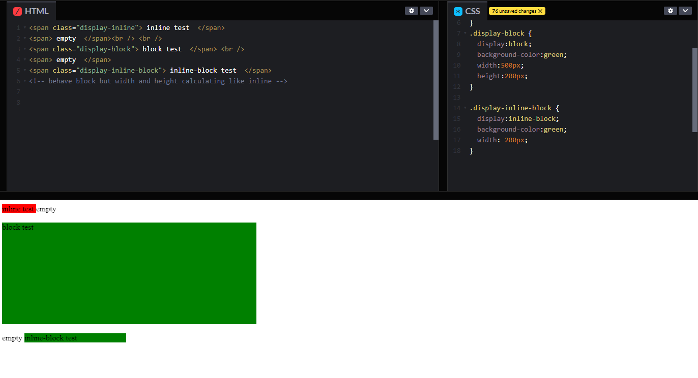

### CSS display Property
* The **display** **CSS** property sets whether an element is treated as a **block or inline element** and the layout used for its children, such as **flow layout, grid or flex**.

```css
/* precomposed values */
display: block;
display: inline;
display: inline-block;
display: flex;
display: inline-flex;
display: grid;
display: inline-grid;
display: flow-root;

/* other value */
display: table;
display: table-row;
display: list-item;
```

## ===> some popular display settings

### display: inline
* Displays an element as inline element (like **span**). Any height and width properties will have no effect

### display: block
* Displays an element as a block element (like **p**).It starts on a new line, and takes up the whole width

### display: inline-block
* Displays an element an inline-level block container. the element itself is formatted as an inline element, but we can apply height and width values



### [display: flex](https://github.com/ridvandmrc/Self-Learning/tree/main/css/display/flex)
* Display an element as a block container
* it provides flexibility to arrange child elements
