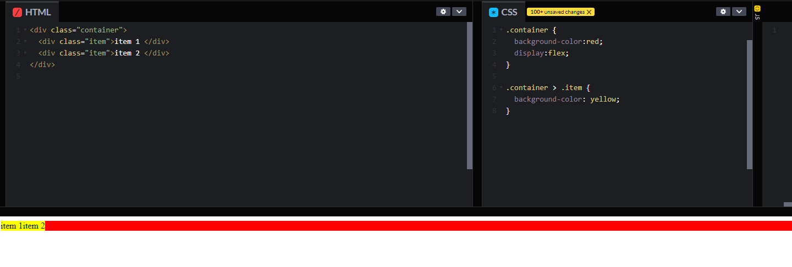
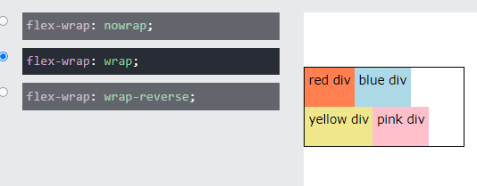
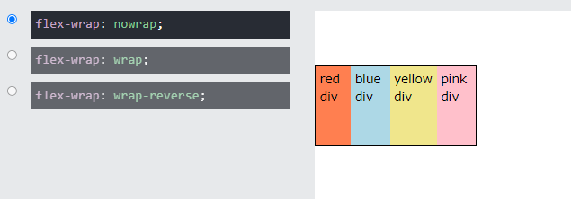
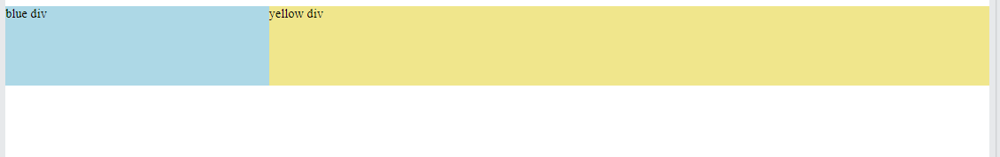
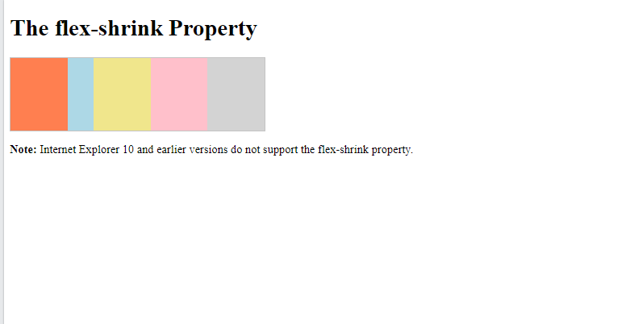

## display: flex
* Display an element as a block container
* it provides flexibility to arrange child elements


### some flex properties
#### **flex**
* we can arrange length of content

```html
<style>
.container {
  background-color:red;
  display:flex;
}

.container > .item {
  background-color: yellow;
  flex:1; /* this provides to shown same length  */
}
</style>

<body>
  <div class="container">
    <div class="item">item 1 </div> <!-- it will shown same length -->
    <div class="item">item 2 </div>
  </div>

</body>
```

* The **flex** property is a shorthand property for: (it will be looked up later)
    * flex-grow
    * flex-shrink
    * flex-basis
* Also, we can use percentage for flex
```css
.flex-container {
  display: flex;
  flex-wrap: wrap;
}

.flex-item-left {
  flex: 50%;
}

.flex-item-right {
  flex: 50%;
}
```

### flex:basis
* Set the initial length of item.
* we can define  pixels, percentages or relative units
* Default value is auto
* if the element is not a flexible item, the **flex-basis** property has no effect

```css
div:nth-of-type(2) {
  flex-basis: 100px;
}
```

### flex-direction Property

* The **flex-direction** property specifies the direction of the flexible items.
* If the element is not a flexible item, the **flex-direction** property has no effect.

Some flex-direction property:
| Value   |      Description      |  
|----------|:-------------:|
| row | Default value. Items are displayed horizontally |
| row-reverse | same as row, but in reverse order   |
| column | items are displayed vertically as a column |
| column-reverse | same as column, but in reverse order|
| initial | sets this property to its default value. |
| inherit | inherits this property from parent|

### flex-wrap property
* The **flex-wrap** property specifies whether the flexible items should wrap or not.
* Default is **nowrap** 

Below example is referring **flex-wrap**



Below example is referring **flex-nowrap**



### flex-flow property
* The **flex-flow** property is a shorthand property for **flex-direction** and **flex-wrap**
* Default value is **row nowrap**


### flex-grow property
* The **flex-grow** property specifies how much the item will grow relative to the rest of the flexible items inside.
* default value is 0

```html
<style>
#bluediv{
  flex-grow:1;
}
#yellowdiv {
  flex-grow:3;
}
</style>

<div id="mymain">
  <div id="bluediv" style="background-color:lightblue;">blue div</div>
  <div id="yellowdiv" style="background-color:khaki;">yellow div</div>
</div>
```
Output of above snippet is that



### CSS flex-shrink property
* The **flex-shrink** property specifies how the item will shrink relative to the rest of the other items
* default is 1 (all of items shrink same)

```html
<style>
  #main div {
  flex-grow: 1;
  flex-shrink: 1;
  flex-basis: 100px;
}

#main div:nth-of-type(2){
  flex-shrink:3;
}

</style>

<div id="main">
  <div style="background-color:coral;"></div>
  <div style="background-color:lightblue;"></div>
  <div style="background-color:khaki;"></div>
  <div style="background-color:pink;"></div>
  <div style="background-color:lightgrey;"></div>
</div>
```
output of above snippet

