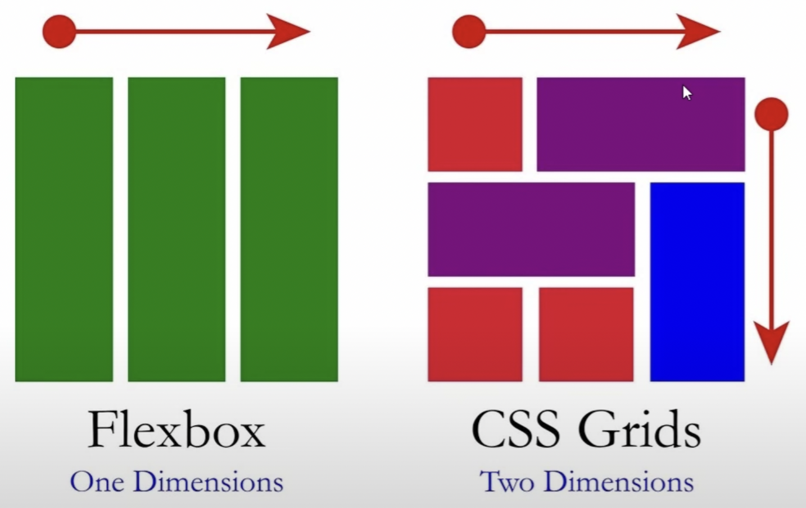
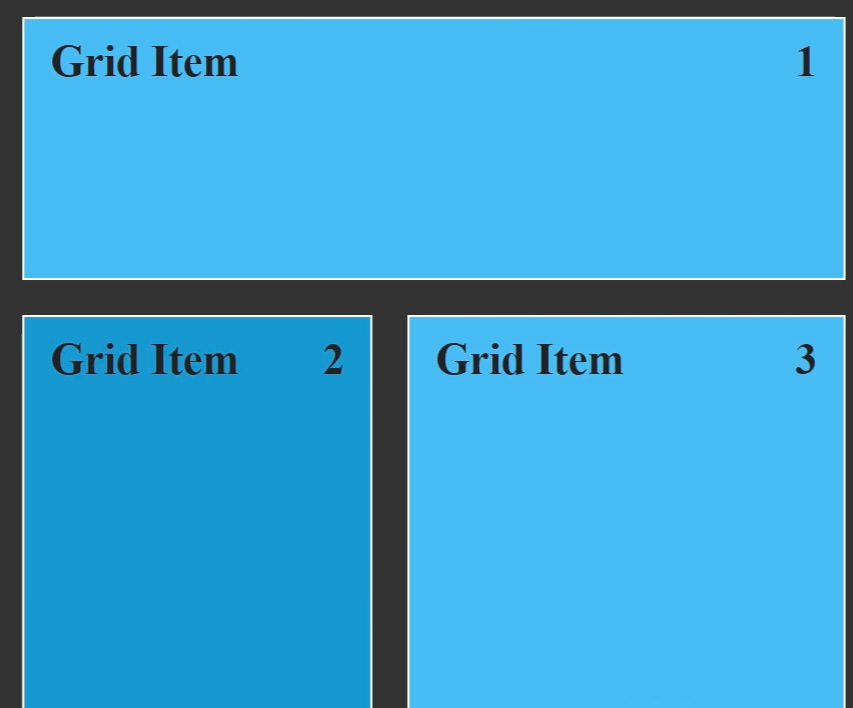
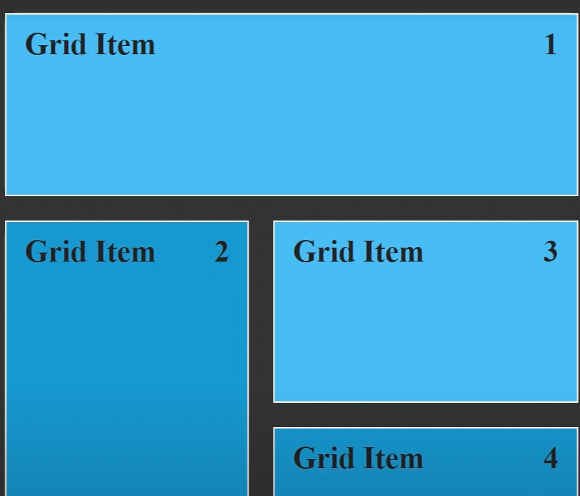

### Grid

- Firstly, let's compare **Grid** with **Flexbox**.
- Flexbox is **one dimensions**, and Grids is **two dimensions**



- Grid is extendable 2 dimentions horizontally and vertically

## Let's start

- Firstly, we should define **grid container**

```html
<style>
  .container {
    display: grid;
  }
</style>
<div class="container">
  <div class="grid-item">1</div>
  <div class="grid-item">2</div>
</div>
```

- Lets continue with the **column calculation**
- We will use **grid-template-columns** to define column size
- **grid-template-columns: 100px 200px**, it will have 2 columns, **first** with is 100px and **second** width is 200px
- **fr** is working like **%**, grid-template-columns: 1fr 2fr;
- and also we can use **repeat** for decreasing reputation **repeat(4, 100px)**

```css
.container {
  display: grid;
  grid-template-columns: 100px 200px;
  // grid-template-columns: 1fr 2fr;
  // grid-template-columns: repeat(4, 100px);
}
```

- Lets go on with the **row calculation**
- We will use **grid-template-rows** to define row size like **grid-template-colums**
- If we want to define **default** row size, we should use **grid-auto-rows**
- If we want to define **minHeight** for row height, **grid-auto-rows: minmax(150px, auto)**

```css
.container {
  grid-auto-rows: 150px;
  grid-template-rows: 200px;
  // grid-auto-rows: minmax(150px, auto)
}
```

- Let's continue with **grid Gap**
- If we want to give some space between **rows or column**
- If only for row, we should use **grid-row-gap: 20px**
- If only for columd, we should use **grid-column-gap: 10px**
- If we will use same value for gap we can use **grid-gap 10px**

```css
.container {
  display: grid;
  grid-row-gap: 10px;
  grid-column-gap: 20px;
  grid-gap: 20px;
}
```

- lets continue with sizing with **grid-template-areas**
- It allows to create a areas with diffrent size
- We should define name in **grid-template-areas**
- Then we can use **grid-area** in **grid-item**

```css
.grid-container {
  display: grid;
  grid-template-areas:
    "header header"
    "sidebar content"
    "sidebar content";
}

.grid-item-1 {
  grid-area: header;
}

.grid-item-2 {
  grid-area: sidebar;
}

.grid-item-3 {
  grid-area: content;
}
```

- The result like ;
  

- And also, we have another option to give a size to **grid element**
- we can use **grid-column-start** and **grid-column-end**
- But, grid calculation works different, we should count with edge(base column gap)
- For end column, we can use **-1**
- Let's look at this example, it draws same thing

```css
.grid-container {
  display: grid;
  grid-gap: 20px;
}

.grid-item-1 {
  grid-column-start: 1;
  grid-column-end: 3; // we should count all edge
  grid-column-end: -1; // also refer end column
}
```

- For short way we can use **grid-column**

```css
.grid-container {
  display: grid;
  grid-gap: 20px;
}

.grid-item-1 {
  grid-column: 1 / -1;
}
```

- Also, we can do samething for **row**,

```css
.grid-container {
  display: grid;
  grid-gap: 20px;
}

.grid-item-1 {
  grid-row-start: 2;
  grid-row-end: 4;
}
```

- As you see, the result is same
  

- Also, we can use **span** to merge **rows and columns**

```css
.grid-container {
  display: grid;
  grid-gap: 20px;
}

.grid-item-1 {
  grid-column: span 2;
}

.grid-item-2 {
  grid-row: span 2;
}

.grid-item-3 {
  grid-row: span 1;
}
```

- Result will show like this:



## Grid Alignment

- We can align items, and also it is very smilar **flexbox**
- we can use **justify-content** and **align-items**
- For the items, we can use **align-self** and **justify-self**
