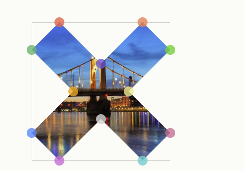

### Clip Path

- Clip path is a feature that is shaping the element like **circle**, **polyghon**.
- Also, you can use use clip path generator to generate polyghon
  // https://bennettfeely.com/clippy/

```css
.container {
  width: 500px;
  height: 500px;
  background-color: red;
  clip-path: circle(50%);
  clip-path: circle(50% at 0 0); // position
  clip-path: polygon(
    20% 0%,
    0% 20%,
    30% 50%,
    0% 80%,
    20% 100%,
    50% 70%,
    80% 100%,
    100% 80%,
    70% 50%,
    100% 20%,
    80% 0%,
    50% 30%
  );
}
```



### Filter, blur, grayscale

- In order to apply a filter to component or an image, we can use this attributes.

```css
filter: blur(10px); // filter image or component
filter: grayscale() // make grayscake image
;
```

### clamp

- it is **css function** clamps a middle value within a range of values betwwen a defined bound and a maximum bound.
- The function takes three parameters: **a minimum, a preferred value and maximum** allowed value.

```css
font-size: clamp(1rem, 2.5vw, 2rem);
width: clamp(3rem, 100%, 10rem);
```

### Aspect Ratio

- Aspect ratio is protecting ratio between **_width and height_**.

```css
width: 100%;
aspect-ratio: 4/2;
```

### perspectice
* it is providing **z-index value** so the component looks high or low dimention.

### :has and not
