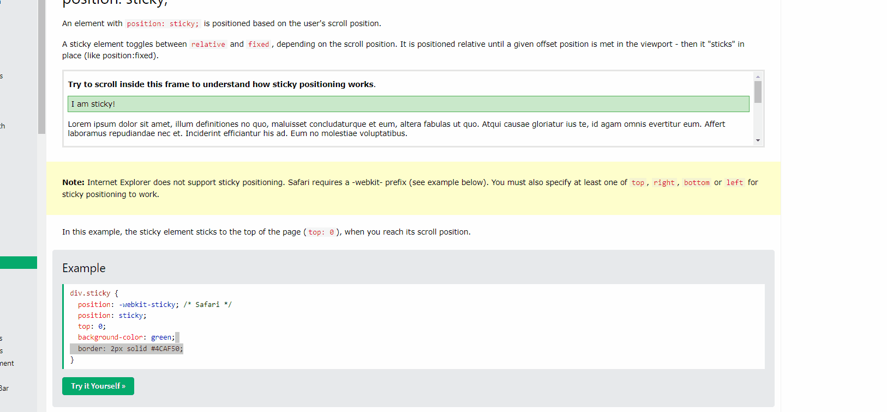

## Position

* The **position** property specifies the type of positioning method used for an element.

There are five different values:
* static
* relative
* fixed
* absolute
* sticky

### Position:static
* HTML elements are positioned static by default.
* Static positioned elements are not affected by the top, bottom, left and right properties.
* **position: static** is not positioned in any special way; it always positioned according to the normal flow of the page.


### Position:relative
* An element with **position:relative** is positioned relative to its normal position.
* we can define top, right, bottom and left properties of a relatively-positioned. 
* if we don't specify any left, right, top and bottom properties, it behaves like **position:static**.

```css
div.relative {
    position: relative;
    left: 30px; /* it has a gap with 30px from left */
}
```

### Position:fixed
* An element with **position: fixed** is positioned relative to the **viewport**, which means it always stays same place even if the page **scrolled**.
* top, left, right and left properties are used ...
* A fixed element does not have a gap in the page where it would normally have been located.

Below statements fixed element in the right bottom corner.
```css
div.fixed {
  position: fixed;
  bottom: 0;
  right: 0;
}
```

### Position: absolute
* An element with **position: absolute** is positioned to has nearest relative element.
* If the there is no relative positioned element, the element is located by body element.
* Absolute positioned elements are removed from normal flow, and can **overlap** elements.

### Position: sticky
* An element with **position: sticky** is positioned based on the user's scroll position.
* A sticky element toggles between **relative** and **fixed**, depending on the scroll position. 

```css
div.sticky {
    position: -webkit-sticky;
    position: sticky;
    top: 0;
    background-color: green;
    border: 2px solid #4CAF50;
}
```

* output of the above snippet is that; 

