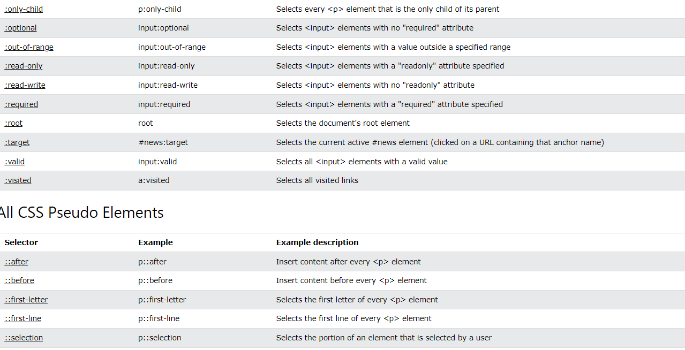

## SELECTORS

CSS selectors are used to "find" (or select) the HTML elements you want to style.

We can divide **css selector** into five categories:

* **Simple Selectors** (select elements based on name, id, class)
* **Combinator selectors** (select elements based on a specific relationship between them)
* **Pseudo-class selectors** (select elements based on a certain state)
* **Pseudo-elements selectors** (select and style a part of an element)
* **Attribute selector** (select elements based on an attribute or attribute value)

### Simple CSS Element Selector

Selects element by using html element name

```css
p {
    text-align: center;
    color: red;
}
```

### CSS id selector

* The id selector uses the id attribute of an HTML element to select a specific element.

* The id of an element should be unique within a page, so the id selector is used to select one unique element!

* To select an element with a specific id, write a hash(#) character, fallowed by the id of the element.

```css
#para1 {
    text-align: center;
    color: red;
}
```

```html
<p id="para1"> Lorem ipsum dolar set amed </p>
```
`note: id can not start with a number `

### CSS class Selector
* The class selector selects HTML elements with a specific class attribute.
* To select elements with a specific class, write a period (.) character, fallowed by the class name.

```css
.center {
    text-align: center;
    color: red;
}
```

* we can also select tag and class

``
In this example only <p> elements with class="center" will be red and center aligned:
``

```css
p.center {
    text-align: center;
    color: red;
}
```

```html
<h1 class="center"> h1 </h1> <!-- this is not affected !-->
<p class="center"> p </p>  <!-- this is not affected !-->
```

* Also HTML element can take more than one class, but the latest one override previous.

```css
p.center {
    text-align: center;
    color: blue;
}

p.color {
    color: red;
}
```

```html
<h1 class="center"> h1 </h1> <!-- this is not affected !-->
<p class="center"> p </p>  <!-- this p is center align and color blue-->
<p class="center color"> p </p>  <!-- this p is center but color is red !-->

```

### The cSS Universal Selector

The universal selector (*) selects all HTML elements on the page.

``
The  CSS rule below will affect every HTML element on the page
``

```css
* {
  text-align: center;
  color: blue;
}
```
### The CSS Grouping Selector

* The grouping selector selects all the HTML Elements with the same style definitions.

* To group selectors, separate each selector with a comma. 

```css
h1, h2, p {
    text-align: center;
    color: red;
}
```

* Above selector select all h1, h2 and p selector.

## ====> SUMMARIZE until now
* select element has a specific class
   ```css
    p.center {...}
   ```
* use '*' for select all element in page.
* to group css selector, use comma for each tags
```css
h1, h2, p {
    text-align: center;
    color: red;
}
```

----------------------

### Combinators Selector

``
A combinator is something that explains the relationship between the selectors.
``

* A CSS selector can contain more than one simple selector. Between the simple selectors, we can include a combinator.

There are four different combinators in CSS:
* descant selector (space)
* child selector (>)
* adjacent sibling selector (+)
* general sibling selector (~)

### Descendant Selector

The descendant selector matches all elements that are descendants of a specified element.

The fallowing example select all <p> elements inside <div> elements:

```css
div p {
 background-color: yellow;
}
```

```html
<div>
  <p>Paragraph 1 in the div.</p> <!-- Selected  -->
  <p>Paragraph 2 in the div.</p><!-- Selected  -->
  <section><p>Paragraph 3 in the div.</p></section> <!-- Selected  -->
</div>

<p>Paragraph 4. Not in a div.</p> <!-- Not Selected  -->
<p>Paragraph 5. Not in a div.</p> <!-- Not Selected  -->
```

### Child Selector ( > )

The child selector selects all elements that are the children of a specified element.

```txt
Note: Child selector is different from the descant selector.
in order to be child, tag is started after parent
```

```html
<div>
    <p>child of div element</p>
    <p> child element of div
        <span> span is not child of div element, but descant of div element </span>
    </p>
</div>
```

```css
div > p {
  background-color: yellow;
}
```
```html
<p>The child selector (>) selects all elements that are the children of a specified element.</p>

<div>
  <p>Paragraph 1 in the div.</p>
  <p>Paragraph 2 in the div.</p>
  <section>
    <!-- not Child but Descendant -->
    <p>Paragraph 3 in the div (inside a section element).</p>
  </section>
  <p>Paragraph 4 in the div.</p>
</div>

<p>Paragraph 5. Not in a div.</p>
<p>Paragraph 6. Not in a div.</p>
```

### Adjacent Sibling Selector ( + )

* The adjacent sibling selector is used to select an element that is **directly after**  another specific element.
* sibling element must have the same parent element,and **"adjacent"** means **immediately following**.

```css
div + p {
  background-color: yellow;
}
```

```html
<div>
  <p>Paragraph 1 in the div.</p>
  <p>Paragraph 2 in the div.</p>
</div>

<p>Paragraph 3. After a div.</p>
<p>Paragraph 4. After a div.</p>

<div>
  <p>Paragraph 5 in the div.</p> <!--  selected-->
  <p>Paragraph 6 in the div.</p>
</div>

<p>Paragraph 7. After a div.</p> <!-- selected -->
<p>Paragraph 8. After a div.</p>
```

### General Sibling Selector ( ~ )

* The general sibling selector **selects all** elements that are **next siblings** of a specified element.

```css
div ~ p {
  background-color: yellow;
}
```

```html
<p>The general sibling selector (~) selects all elements that are next siblings of a specified element.</p> <!-- not-selected, P element but not next sibling  -->

<p>Paragraph 1.</p><!-- not-selected, P element but not next sibling  -->

<div>
  <p>Paragraph 2.</p>
</div>

<p>Paragraph 3.</p> <!-- selected -->
<code>Some code.</code>
<p>Paragraph 4.</p> <!-- selected -->
```

### ===> Summarize Until Now
* Use space for descant selector 
```css
div p {
  color: red;
}
```
* Use '>' for child selector
```css
div > p {
  color: blue;
}

<div>
  <p> asd </p> /* this is child of div  */
  <h1>
    <p> asd </p> /* this is not a child, but this is descant  */
  </h1>
</div>
```
* Use '+' for adjacent sibling selector

```css
div + p{
  color: red;
}

<div>
  <p>Paragraph 1 in the div.</p>
  <p>Paragraph 2 in the div.</p> /* not selected, child and descant */
</div>

<p>Paragraph 3. After a div.</p> /* selected, adjacent  */
```
* Use '~' for general sibling selector
```css
div ~ p {
  color: red;
}

<p> not selected </p>
<div>
  <p> not selected </p>
</div>

<p> selected </p>
<p> selected </p>
```

## Pseudo-classes

* it provides to use special state of element.

Some example;
*  mouseover
* visited, unvisited
* focus

### Syntax
Usage of pseudo classes

```css
selector:pseudo-class {
  property: value;
}
```
* links can be displayed in different ways:

```css
/* unvisited link */
a:link {
  color: #FF0000;
}

/* visited link */
a:visited {
  color: #00FF00;
}

/* mouse over link */
a:hover {
  color: #FF00FF;
}

/* selected link */
a:active {
  color: #0000FF;
}
```

* sample tooltip implementation
```css
p {
  display: none;
  background-color: yellow;
  padding: 20px;
}

div:hover p {
  display: block;
}
```
### CSS - The :first-child Pseudo-class
The `:first-child` pseudo-class matches a specified element that is the first of another element.

```css
p:first-child {
  color: blue;
}


<p>This is some text.</p> /* selected */
<p>This is some text.</p>

<div>
  <p>This is some text.</p> /* selected */
  <p>This is some text.</p>
</div>

/* --------------------------------------- */
p i:first-child {
  color: blue;
} 
/* both i are selected */
<p>I am a <i>strong</i> person. I am a <i>strong</i> person.</p>
<p>I am a <i>strong</i> person. I am a <i>strong</i> person.</p>
```

### CSS- The :lang Pseudo-class

The **:lang** pseudo-class allows us to define special rules for different languages.

```html
<html>
<head>
<style>
q:lang(no) {
  quotes: "~" "~";
}
</style>
</head>
<body>

<p>Some text <q lang="no">A quote in a paragraph</q> Some text.</p>

</body>
</html>
```


