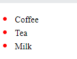

## Pseudo-element selector

A css-pseudo-element is used to style specified parts of an element.

Some Example:

- Style the first letter, or line, of an element
- Insert content before, or after, the content of an element

- Classic syntax of pseudo-elements:

```css
selector::pseudo-element {
  property: value;
}
```

Some important **Pseudo-element**.

### First Line

- The **_::first-line_** Pseudo-element.

```css
p::first-line {
  color: #ff0000;
  font-variant: small-caps;
}

### First Letter
```

- The **::first-letter** pseudo-element

```css
p::first-letter {
  color: #ff0000;
  font-size: xx-large;
}
```

### Before

- The **::before** Pseudo-element: can be used to insert some content before the element.

```css
h1::before {
  content: url(smiley.gif);
}
```

### After

- The **::after** Pseudo-element: can be used to insert some content after the content of an element.

```css
h1::after {
  content: url(smiley.gif);
}
```

### Marker

- The **_::marker_** pseudo-element selects the markers of list items.

```css
::marker {
  color: red;
  font-size: 23px;
}

<ul>
<li> Tea </li>
<li> Coffee </li>
<li> Milk </li>

```



### ::selection Pseudo-element

The **::selection** pseudo-element matches the portion of an element that is selected by a user.

- it will be activated when select by mouse.

```css
::selection {
  color: red;
  background: yellow;
}
```

### :is(element,element) (new feature)

- **:is** is the new feature for css selector
- if we want to select same group element we can use it
- also, **:is** has specificty so maybe **:is** can be overrided unexpectedly
- group css can not be worked, if a group is wrong but **:is** always work

```scss
// instead of this;
div a,
div li,
div .success {
}

// use this
div :is(a, li, .success) {
}

:is(div, li, a) > div {
}
```

### :where(element, element) (new feature)

- **:where** is almost same with **:is**
- But it does not care **about specificty**
- and also we can use **:where** self

```scss
// instead of this
div a,
div li,
div .success {
}

// use this
div :where(a, li, .success) {
}

div :where(li, a, .success) {
}
```

### :has(element) (new feature)

- this is helpful for select the parent element
- this is new feature and game changer

```scss
// select div if has .success child
div:has(.success) {
}

// select p if has .success siblings
div:has(.success) > p {
}
```

### ===> Summarize

- we can use pseudo element selector to define element behavior.
  - ::first-line
  - ::first-letter
  - ::before
  - ::after
  - ::marker
  - ::selection
