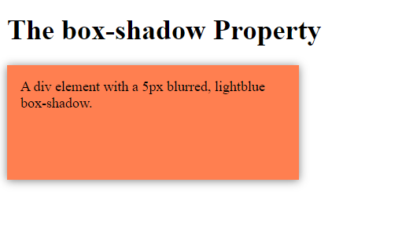
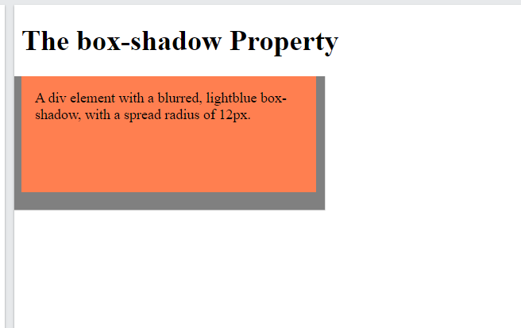

## CSS Box Shadows
* The **box-shadow** property can be used to add one or more shadow to element

### Specified a horizontal and vertical shadow
* **Syntax**: box-shadow horizontal vertical;

```css
div {
  box-shadow: 10px 10px;
}
```

### Specified a Color  for the shadow
* The color parameter defines the color of the shadow
* **syntax**: box-shadow: horizontal vertical **color**;
```css
div {
  /* box-shadow: horizontal vertical color; */
  box-shadow: 10px 10px lightblue;
}
```

### Add a blur effect to the shadow
* The **blue** parameter defines the blur radius.
* **Syntax:** box-shadow: horizontal vertical **blur** color;
```css
div {
  box-shadow: 10px 10px 5px lightblue;
}
```


### Set the  spread Radius of the shadow
* The **spread** parameter defines  the spread radius.
* A positive value **increases** the size of the **shadow**.
* A negative  value **decreases**  the size of **shadow**.

* **syntax:** box-shadow: horizontal vertical blur **spread** color.

```css
div {
  box-shadow: 10px 10px 5px 12px lightblue;
}   
```


### Set the inset Parameter
* The **inset** parameter  changes the shadow from outside to inner shadow.
* **syntax:** box-shadow: horizontal vertical blur spread color **inset**
```css
div {
  box-shadow: 10px 10px 5px lightblue inset;
}
```
### Add Multiple Shadows
* An element can accept more than one box-shadow.
* use comma to provide this.

```css
div {
  box-shadow: 5px 5px blue, 10px 10px red, 15px 15px green;
}
```

## =======> Summary
* we can add one or more shadow to element
* syntax is basically: 
```css
box-shadow: horizontal vertical blur spread color;
```
* you can set shadow **inset** instead of outside(default)
```css
box-shadow: horizontal vertical blur spread color inset;
``` 