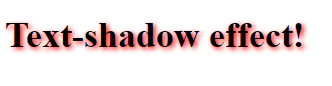
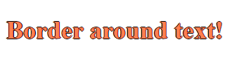

## CSS Text Shadow
* The CSS **text-shadow** property applies shadow to text.
* In its simples use, we can only specify the horizontal and vertical shadow

### Syntax
**text-shadow**: horizontal-position vertical-position;


```css
h1 {
  text-shadow: 2px 2px;
}
```

* As Next, we can add color to shadow

### Syntax
**text-shadow**: horizontal-position vertical-position **color**;
```css
h1 {
  text-shadow: 2px 2px red;
}
```

* Then we can add blur effect

### Syntax
**text-shadow:** horizontal-position vertical-position **blur-effect** color;

```css
text-shadow: 2px 2px 5px red;
```



### Multiple shadows
* we can add multiple shadow to element
* To provide this, we should define shadow with comma separated.

```css
h1 {
  color: white;
  text-shadow: 1px 1px 2px black, 0 0 25px blue, 0 0 5px darkblue;
}
```

* Border-around-text: we can added border to around text to create a plain border around some text. (without shadow)

```css
h1 {
  color: coral;
  text-shadow: -1px 0 black, 0 1px black, 1px 0 black, 0 -1px black;
}
```




## ==========> Summary
* In order to apply shadow to text, we should use **text-shadow**
* basically syntax: 
```css
    text-shadow: horizontal vertical blur color;
```
* we can add multiple shadow by using comma.
* we can provide text border by using 1 or -1 shadows.