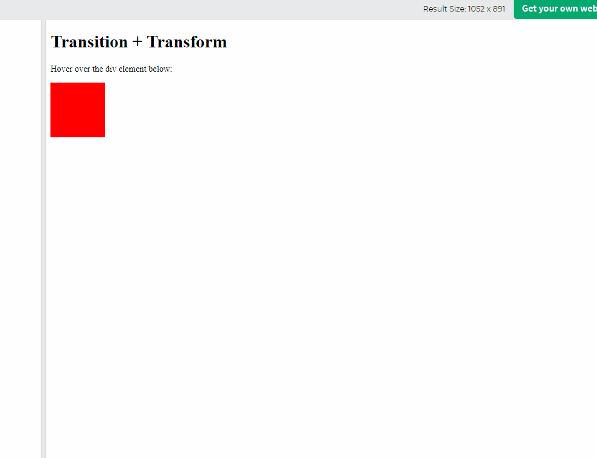

## CSS Transitions
* CSS transitions allows us to change property values smoothly, over given duration
* To crate a transition effect, we must specify two things
    * CSS property that we want to add an effect to (**default all**)
    * Duration of the effect

``
Note: If duration is not specified, transition will have no effect, because the default value is 0.
``
* **Syntax:** transition: property duration

```css
div {
  width: 100px;
  height: 100px;
  background: red;
  transition: width 2s;
}

div:hover {
    width: 300px;
}
```

## Change several property of Values
* it can be affected more than one properties by using comma separated.

```css
div {
  transition: width 2s, height 4s;
}
```

## Specify the Speed Curve of the Transition
* **ease:** specifies a transition effect with a slow start, then fast, then end slowly (**default**)
* **linear**: specifies a transition effect with **same** speed
* **ease-in:** specifies a transition effect with a **slow start**
* **ease-out:** specifies a transition effect with a **slow end**
* **ease-in-out:** specifies a transition effect with a **slow start and end**
* **cubic-bezier(n,n,n,n):** let us define our own pattern

```css
#div1 {transition-timing-function: linear;}
#div2 {transition-timing-function: ease;}
#div3 {transition-timing-function: ease-in;}
#div4 {transition-timing-function: ease-out;}
#div5 {transition-timing-function: ease-in-out;}
```

## Delay the Transition Effect
* The **transition-delay** property specifies a delay (in seconds) fro the transition effect.

```css
/* has 1 second delay before starting */
div {
  transition-delay: 1s;
}
```

## Transition + Transform
* we can mix transition and transform 

```css
div {
  transition: width 2s, height 2s, transform 2s;
}
```



```css
div {
  transition-property: width;
  transition-duration: 2s;
  transition-timing-function: linear;
  transition-delay: 1s;
}
```

## =========> Summary
* we must define duration of transition, because default is 0
* we can chose multiple feature to apply transition
* there are some timing function
    * **linear:** animation with linear speed
    * **ease:** animation with slow-normal-slow
    * **ease-in:** animation with slow-normal-fast
    * **ease-out:** animation with fast-normal-slow
    * **ease-in-out:** animation with slow-normal-slow
    * **cubic-bezier:** animation with custom (n,n,n,n)