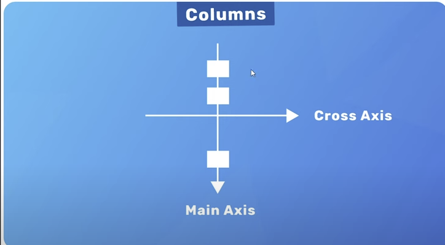
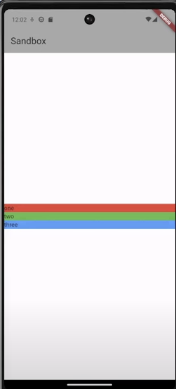
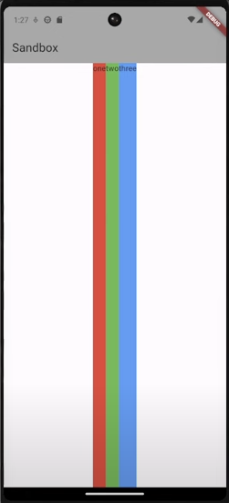

### Columns

- Columns includes more than one children
- it listed the component **vertically**.
- Alignment is so important for **Column**.
- For vertical alignment, it should be **MainAxis**,
- For horizontal it should be used **crossAxis**.



```dart

//...
Column(
    crossAxisAlignment:CrossAxisAlignment.stretch,
    mainAxisAlignment:MainAxisAlignment.center,
    children:[
        Container(
            child:const Text('one')
        ),
        Container(
            child:const Text('two')
        )
    ]
)

//...

```



### Row

- Rows includes more than one children
- it listed the component **horizontally**.
- Alignment is so important for **Rows**.
- For vertical alignment, it should be **MainAxis**,
- For horizontal it should be used **crossAxis**.

```dart
Row(
    mainAxisAligment: MainAxisAlignment.center,
    crossAxisAlignment: CrossAxisAlignement.stretch,
    children:[...‚]
)
```



### SizedBox

- It is a placeholder.
- while using this, it needs to be defined a **width** or **height**

```dart
Row(
    children:[
        Text:('strength'),
        Text:(3),
        SizedBox(width: 50)
    ]
)
```

### Images

- For images, it is better to create a **assets** folder
- To inglude the assets in the project.
  we should add path under the assets **pubspec.yaml**

```yaml
assets:
  - assets/img/coffe_bg.jpg
  - assets/img/sugar_cube.png
```

- Flutter has a component that named **Image**

```dart
    ...
    Image.asset('assets/img/coffea_bean.png',
    color: Color.brown, // image color
    colorBlendMode: BlendMode.multiply //blend Mode
    )
    ...
```

### Expanded Widget

- it always wrap available space like **margin: auto**.
- we can think **sizedBox** with **100% width**
- Also, we can use **flex property** to align the contents 

```dart
...
Expanded(
    child: Image.asset('asset/img.png',
    fit:BoxFit.fitWidth, // image property
    alignment: Alignment.bottomCenter //image propery
    )
)
...
```

```dart
...
Expanded(
    flex: 3
    child: Container(
        padding: EdgeInsets.all(30)
        color: Colors.cyan,
        child: Text('1'),
    )
),
Expanded(
    flex: 2
    child: Container(
        padding: EdgeInsets.all(30)
        color: Colors.cyan,
        child: Text('1'),
    )
),
Expanded(
    flex: 1
    child: Container(
        padding: EdgeInsets.all(30)
        color: Colors.cyan,
        child: Text('1'),
    )
)
...
```


### Buttons

- We can use the buttons from materialUI directly.
- elevated, filled text button.
- They have also onPress method to handle click.
- Also we can manipulate **style**.

```dart
...
void foo(){

}

...
FilledButton(
    child:Text('+'),
    onPress:foo
    style: FilledButton.styleFrom(
        backgroundColor:Colors.brown,
        foregroundColor:Colors.white
    )
)

```

### Center Widget

- This widget center the wigdet vertically and horizontally

```dart
Center(
    child:Text('aloo')
)
```

### Adding Font
* Find the font and download the **ttf** file.
* Create a folder **named fonts** and put the **ttf** file in that folder.
* Update the **pubspect.yaml** file

```yaml
    fonts:
    - family: Test
      fonts:
        - assets: fonts/test-file.ttf
```

```dart
fontFamily: 'Test'
```