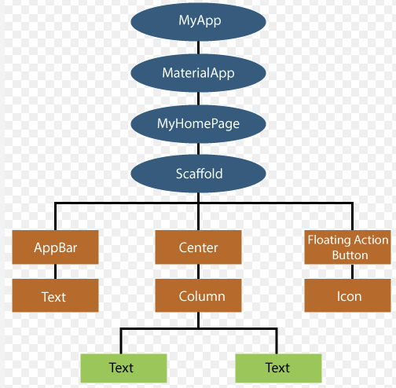
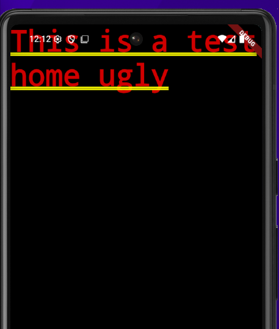
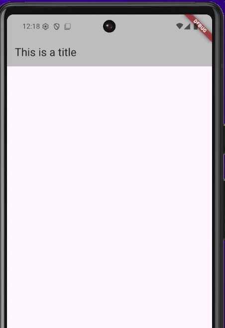

## Widgets

* widget is a key concept of the flutter.

* Stateless and Statefull widget

* **MaterialApp** and **Cubertunio** theme can be used 

* **Widget Tree**
    - The widget can be used hierarchical
    - The widgets can be used **more than one** and **nested**

* **Builtin widget**
    - Flutter provides some built-in widget and it can be used.
    - Hot reload is not supporting for builtin widgets.


* **MatrialApp**
    * This widget is a special widget.
    *  It should be used with **runApp** method which is under the **main** function

#### const keyword
* It the widget is **stateless** and nothing is changing.
* Then it should be marked as a **const** which provides **performance improvement**.
* It widget is marked by **const** flutter recognize that widget not changed and it won't be **rendered** again.


#### Text widget 
* If needs a **text**, this widget should be used.
* It also has another parametes which contains style things.

```dart

title: Text('This is a title'),

```

#### Scaffold
* It is a **boilerplate** for flutter.
* And also, it provide proper view for mobile app, such as **topbar, body and footer**.

```dart
void main() {
  runApp(MaterialApp(
    home: Scaffold(
      appBar: AppBar(
        title: Text('This is a title'),
        backgroundColor: Colors.grey.shade400,
      ),
  )));
}
```

#### Without scoffold
```dart
import 'package:flutter/material.dart';

void main() {
  runApp(MaterialApp(
    home: Text('This is a test home ugly'),
    title: 'looo',
  ));
}
```


| Without scoffold | Scoffold |
|-|-|
|  |  |
|-|-|

* **Custom Widget**
    - It can be **stateless** and **statefull**.
    - it should contains **build function** so it supports hot reload.
    - The constructure must be used.

```dart
class CustomHome extends StatelessWidget {
  const CustomHome({super.key});

  @override
  Widget build(BuildContext context) {
    return const Text('This is a custom component');
  }
}
```

#### Container Widgets
* **wraps** other widgets
* it can contains other widgets.
* It is quite flexable to shape the children.
* You can use style to manipulate the widget.
* the style is similar to **CSS**

```dart
class CustomHome extends StatelessWidget {
  const CustomHome({super.key});

  @override
  Widget build(BuildContext context) {
    return const Text('This is a custom component');
  }
}
```

### Imports
* we can use the component in different files.
* Then we can import the files from another files like main files.
* the files should be under **lib** folder.
* the it should be used **relative path**

```dart
import 'package:project_name/...dart' 

// we can use the component directly

```

## Styling
* It smiliar like **css**
* It supports material design system.

## Hot reload
* Built in function is not hot reload
* Custom widget has this feature.


