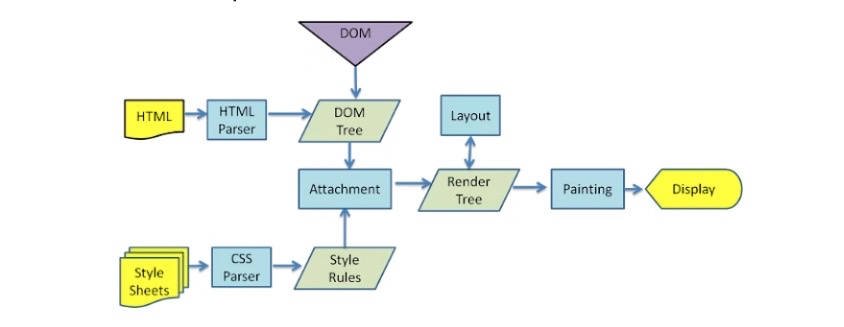

## How Browser Works?

- Main feature of **Browsers**

* The browser present resource of the site.
* It display the page that is request from server
* The Resource generally can be HTML, image and PDF.
* the way of HTML and CSS interpreterand displaying the screen is following the specifications.
* These specifications decided by **WC3**

## Browser's High level Structure

### Rendering Engine:

- Render engine is responsible for rendering engine and processing of the content.
- As a default it is responsible for **HTML and XML**

### Main FLOW

- Rendering engine will get document from newwork layer.
- Then, Render engine will start to parse **HTML** document and will convert it **DOM node content tree**
- Also, Render engine will parse style datas.
- Style information will use other **tree for styling information**, **Render tree**

- **Render Tree**: contains visiual attributes, color and size. This rectangle provide to display content correct order.

- For better user experience, **Render enginee** displays the content immediatly.
- It does not wait parsing the HTML and put the render tree.
- It renders part by part,
- While process keep going remain content keep coming.

