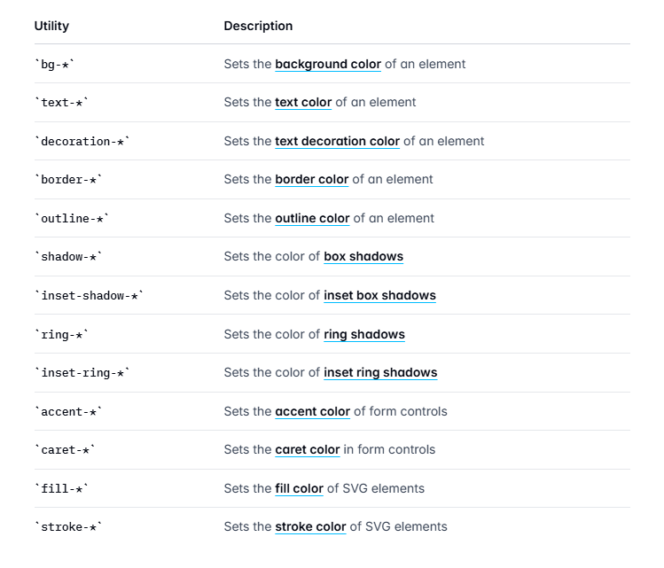

### Colors
* Using and customizing  the color palette in Tailwind
* The patter is colors start with 50 to 950 and the color is
getting light to dark

### Opacity
- for the opacity we can just use /<value> like,
bg-sky-500/30