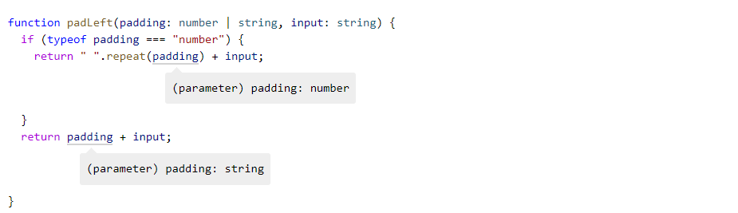
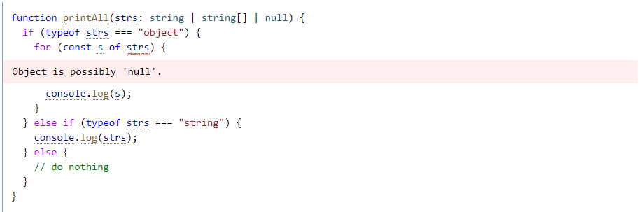
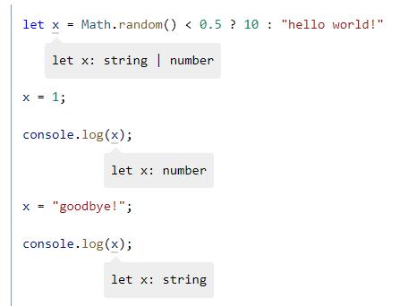
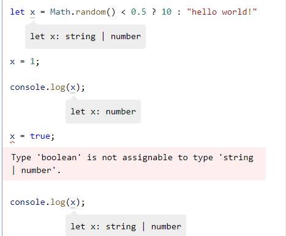

## Narrowing

Let's try to implement function called ***padLeft***.

```ts
function padLeft(padding: number | string, input: string): string {
  throw new Error("Not implemented yet!");
}
```

If **padding** is a **number**, it will treat that as the number of spaces we want to prepend to **input**. If **padding** is a **string**, it should just prepend **padding** to **input**. Let’s try to implement the logic for when padLeft is passed a **number** for **padding**.

```ts
function padLeft(padding: number | string, input: string) {
  return " ".repeat(padding) + input;

/*Argument of type 'string | number' is not assignable to parameter of type 'number'.
  Type 'string' is not assignable to type 'number'. */
}
```


* We will get an error,  because ***repeat*** is accepting number as a type but padding can be string.

* We can fix this issue by checking type of padding

```ts
function padLeft(padding: number | string, input: string) {
  if (typeof padding === "number") {
    return " ".repeat(padding) + input;
  }
  return padding + input;
}
```

* this can be looked like interesting because it's looking completely JS code. special type checking called **type guard**.

* But types script can understand this check and create separate branch and declare it called ***narrowing***.



### ***typeof*** type guards

* "string"
* "number"
* "bigint"
* "boolean"
* "symbol"
* "undefined"
* "object"
* "function"

and also TS check nullable or not.



### The **in** operator narrowing

JS has an operator for determining  if an object has a property with a name. the **in** operator.

```ts
type Fish = { swim: () => void };
type Bird = { fly: () => void };
 
function move(animal: Fish | Bird) {
  if ("swim" in animal) {
    return animal.swim();
  }
 
  return animal.fly();
}
```

### ***Asssignments*** ###

When we assign to any variable, TS looks at the right side of the assignment and the left side appropriately.



Notice that each of these assignments is valid. Although the observed type of ***x*** changed to ***number*** after our first assignment. This is because the declared type of ***x*** - the type that ***x*** started with ***string | number***. 

let's try it out assign boolean.
