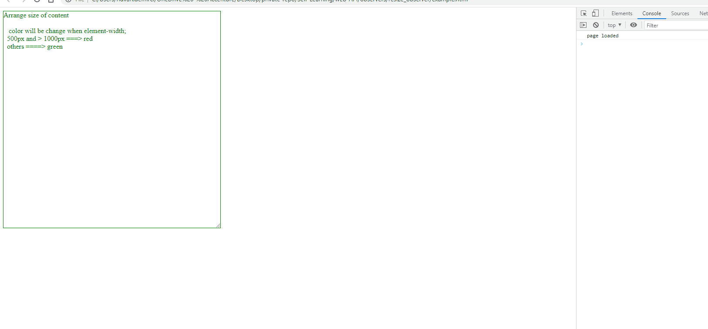

## Resize Observer
* Resize observer provide that can monitor an element for changes to its size, with notification being delivered to observer each time the size changes

### Usage and Concepts
* If needs to compare with **media queries** or **watchMedia**, they are great for the tracking screen changes, but what if we want to change layout in response to a specific element's size change. and what if we want to listen css variable

* **ResizeObserver** provides a solution these kinds of problems, easily observe and respond to changes in the size of an element's content or border box in a performant way.

### Usage
* Usage is simple, and almost same as other observers, such as **Performance Observer** or **Intersection Observer**.
* Create a new ResizeObserver using the **ResizeObserver()**
* then, use **ResizeObserver.observe()** to make it look for changes.

### Examples 
```js
const resizeObserver = new ResizeObserver(entries => {
    for(let entry in entries){
        ...
    }
})

resizeObserver.observe(document.querySelector('div'))
```

